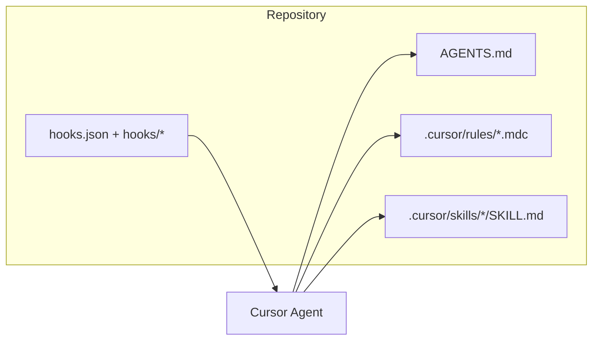

# План: індексація проєкту + Cursor rules, skills, hooks

## Контекст репозиторію

- **Стек**: [package.json](package.json) — Next.js 15, React 18, TypeScript 5.6, `next-intl`, Zod, Vitest + MSW, ESLint/Prettier; деплой через Cloudflare (`@cloudflare/next-on-pages`, `wrangler`).
- **Маршрути**: `app/[locale]/...` + `app/api/...`; локалізація — [i18n/routing.ts](i18n/routing.ts), [middleware.ts](middleware.ts) (intl + auth cookies/refresh).
- **Зараз**: каталогу [`.cursor/`](.cursor/) немає; [AGENTS.md](AGENTS.md) немає — агент не має закріпленого «карти» репо в git.

«Проіндексувати» тут трактуємо як **закодувати структуру та конвенції в репо** (AGENTS + rules + skills), а не як окрему дію в IDE — вбудована індексація Cursor працює сама.

---

## 1. AGENTS.md (карта проєкту)

Створити кореневий [AGENTS.md](AGENTS.md) (~80–120 рядків, стисло):

- **Призначення**: кабінет користувача (auth, billing/balance, workflows, інтеграції).
- **Дерева**: `app/` (сторінки + API), `components/`, `lib/` (auth, API-клієнти, middleware helpers), `hooks/`, `types/`, `messages/`, `contexts/`, `test/`.
- **Команди**: `yarn dev` / `prod` (через `dotenv-cli`), `yarn test`, `yarn lint:check`, `yarn verify:ci` — з [package.json](package.json).
- **Оточення**: лише імена змінних з [env.example](env.example) (без секретів).
- **Вузлові файли**: посилання на [lib/auth.ts](lib/auth.ts), [middleware.ts](middleware.ts), [config/api.ts](config/api.ts) як точки входу.

Це головний «індекс» для людей і для агента.

---

## 2. Rules — `.cursor/rules/*.mdc`

Дотримуватися [create-rule](~/.cursor/skills-cursor/create-rule/SKILL.md): **короткі правила, одна тема на файл**, `alwaysApply` або `globs`.

Пропонований набір (усі в межах ~30–50 рядків):

| Файл | `alwaysApply` / `globs` | Зміст |
|------|-------------------------|--------|
| `core-stack.mdc` | `alwaysApply: true` | Node 20.18 + Yarn; Next 15 App Router; уникати `any`; нові залежності лише за потреби; відповіді користувачу українською (узгоджено з вашими глобальними правилами). |
| `next-app-pages.mdc` | `app/**/*.tsx` | Патерн `app/[locale]/`, `Link` з локаллю, server vs client components. |
| `api-routes.mdc` | `app/api/**/*.ts` | Route handlers, JSON помилки ([lib/api-json-error.ts](lib/api-json-error.ts) якщо використовується), cookies/headers узгоджено з [lib/auth-cookies.ts](lib/auth-cookies.ts). |
| `i18n.mdc` | `messages/**/*.json`, `i18n/**/*.ts` | Ключі повідомлень, синхронність ключів між локалями. |
| `components-ui.mdc` | `components/**/*.tsx` | shadcn-подібні [components/ui/](components/ui/), a11y, існуючі примітиви. |

Не дублювати десятки сторінок коду в rules — лише **посилання на файли** та 2–3 приклади.

---

## 3. Project skills — `.cursor/skills/<name>/SKILL.md`

Згідно з [create-skill](~/.cursor/skills-cursor/create-skill/SKILL.md): каталоги під `.cursor/skills/`, frontmatter `name` + `description`, для більшості — `disable-model-invocation: true` (явне «використай skill X»), окрім skill який описує загальну архітектуру — можна **не** ставити `disable-model-invocation`, щоб опис у `description` допомагав автопідбору (за бажанням; у плані закладемо один «архітектурний» з широким description).

Пропоновані skills:

1. **`aicrow-architecture`** — потоки auth (tokens, refresh), middleware + локалі, де лежать API-клієнти (`lib/api*.ts`), типові шляхи для нових фіч.
2. **`aicrow-add-locale-string`** — кроки: додати ключ у всі `messages/*.json`, використати `next-intl` на сторінці.
3. **`aicrow-testing`** — Vitest, [vitest.config.ts](vitest.config.ts), [test/setup/vitest.setup.ts](test/setup/vitest.setup.ts), MSW; коли додавати тести до `app/api` / `lib`.

Опційно четвертий: **`aicrow-cloudflare-pages`** — `pages:build`, `wrangler`, обмеження edge — якщо часто чіпаєте деплой.

---

## 4. Hooks — `.cursor/hooks.json` + `.cursor/hooks/*`

Згідно з [create-hook](~/.cursor/skills-cursor/create-hook/SKILL.md): версія `1`, шляхи від кореня проєкту, скрипти з shebang, **executable**, без припущення про `jq` (у репо його немає як залежності).

**Рекомендований мінімум «найкращих практик»:**

1. **`beforeSubmitPrompt`** → `.cursor/hooks/check-prompt-secrets.mjs` (Node, без дод. пакетів):
   - читати stdin JSON;
   - якщо у тексті промпта є типові патерни секретів (напр. `sk_live_`, довгі base64-подібні токени, фрагменти `-----BEGIN`, явні `password=` + довгі рядки) — повертати дозволену для події відповідь з `permission: "ask"` та коротким `user_message` (українською);
   - інакше `permission: "allow"`.
   - `failOpen`: не блокувати роботу при падінні скрипта (без `failClosed`), щоб не зламати сесію.

2. **`beforeShellExecution`** (опційно, з простим matcher) → `.cursor/hooks/shell-guard.sh`:
   - для команд типу `wrangler pages deploy`, `git push --force`, масове `rm -rf` поза проєктом — `permission: "ask"`;
   - решта `allow`.
   - Реалізація на bash без `jq`: парсинг через `node -e` з stdin або обережний grep по полю `command` (перевірити актуальну форму JSON у документації Cursor hooks; якщо структура інша — підлаштувати парсер у скрипті).

Після імплементації: **перевірити один реальний тригер** у Cursor (Hooks output channel).

---

## 5. Додатково (рекомендація без роздування)

- **`.cursorignore`** (якщо потрібно): виключити важкі/генеровані шляхи, якщо вони з’являться (напр. `.next/`, `coverage/`) — лише якщо агент часто читає шум.
- **Не** додавати `afterFileEdit` з повним `eslint --fix` на кожен змінений файл без узгодження — це повільно й дратує; краще залишити якість на `yarn lint:check` + CI ([.github/workflows/test-and-lint.yml](.github/workflows/test-and-lint.yml)).

---

## Порядок виконання (після підтвердження плану)

1. Створити `.cursor/rules/` з п’ятьма `.mdc`.
2. Створити `.cursor/skills/<skill>/SKILL.md` (3–4 skills).
3. Додати `AGENTS.md`.
4. Додати `.cursor/hooks.json` + скрипти, `chmod +x` для shell-скриптів.
5. Швидка перевірка: наявність frontmatter у rules, валідний JSON у `hooks.json`, запуск node/bash скриптів з тестовим stdin локально в терміналі.

