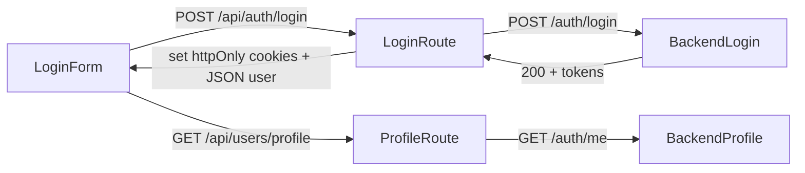

# Auth architecture & security (frontend)

> Мова: українська  
> Скоуп: фронтенд (Next.js) + BFF/proxy, без бекенд-імплементації

## 1. Загальна ідея

- **Єдиний спосіб авторизації** — `httpOnly` cookies з JWT:
  - `access_token`
  - `refresh_token`
  - `device_id` (не `httpOnly`, потрібен на клієнті)
- **Жодного читання токенів з клієнта**:
  - заборонені `document.cookie` / `localStorage` / `sessionStorage` для `access_token` / `refresh_token`.
- Усі запити до приватних backend endpoint йдуть **через BFF/proxy на фронті**:
  - або через універсальний proxy `/api/proxy/**`,
  - або через конкретні `app/api/**` маршрути.

## 2. Cookie policy

- `access_token` / `refresh_token`:
  - `httpOnly: true`
  - `sameSite: "strict"`
  - `secure: process.env.NODE_ENV === "production"`
  - `path: "/"`,
  - коректний `maxAge` на основі `exp`.
- `device_id`:
  - `sameSite: "strict"`
  - без `httpOnly` (читання на клієнті через `lib/auth.ts`).
- Вся політика зосереджена в `lib/auth-cookies.ts`.

## 3. Потоки авторизації

### 3.1. Login / Verify email

- UI:
  - `components/auth/LoginForm.tsx`
  - `contexts/AuthContext.tsx` (використовує `/api/auth/login` та `/api/users/profile`).
- BFF:
  - `app/api/auth/login/route.ts`
  - `app/api/auth/verify-email/route.ts`
- Backend:
  - `API_CONFIG.ENDPOINTS.AUTH.LOGIN`
  - `/auth/verify-email` (через `API_CONFIG.BASE_URL`).

Повний flow:



### 3.2. Refresh

- Клієнт **не оновлює токени самостійно**.
- Два механізми:
  - `contexts/AuthContext.tsx` викликає `/api/auth/refresh` періодично;
  - `app/middleware.ts` викликає `authApi.refreshToken` для root/protected маршрутів.
- BFF:
  - `app/api/auth/refresh/route.ts` (оновлює cookies з `httpOnly`).

### 3.3. Logout

- UI:
  - `AuthContext.logout()`.
- BFF:
  - `app/api/auth/logout/route.ts` (чистить cookies через `auth-cookies`).

### 3.4. Proxy/BFF для приватних API

- Коли потрібен виклик до приватного backend endpoint **з клієнта**:
  - використовуємо `lib/auth.fetchWithAuth(url, options)`.
  - він перенаправляє запит на `/api/proxy/**`, а не напряму на backend.
- Route:
  - `app/api/proxy/[...path]/route.ts`.

Повний proxy flow:

```mermaid
flowchart LR
  Client -->|fetchWithAuth| ProxyRoute
  ProxyRoute -->|read cookies (httpOnly)| CookieJar
  ProxyRoute -->|forward with Authorization + x-device-id| BackendApi
  BackendApi -->|200| ProxyRoute
  ProxyRoute -->|JSON| Client

  BackendApi -->|401| ProxyRoute
  ProxyRoute -->|POST /auth/refresh| BackendRefresh
  BackendRefresh -->|200 + new tokens| ProxyRoute
  ProxyRoute -->|set cookies + retry| BackendApi
```

## 4. Admin impersonation

- Start:
  - `lib/apiAuth.authApi.impersonateUser`
  - `app/api/auth/admin/users/[id]/impersonate/route.ts`
- Stop:
  - `lib/apiAuth.authApi.stopImpersonation`
  - `app/api/auth/admin/stop-impersonate/route.ts`

Політика:

- Перед impersonation:
  - бекап admin-токенів у `admin_access_token` / `admin_refresh_token` / `admin_device_id`.
- Після impersonation:
  - нові `access_token` / `refresh_token` / `device_id` для impersonated user;
  - `impersonation_meta` для UI.
- Stop:
  - відновлюємо admin cookies із `admin_*`;
  - очищаємо `impersonation_meta` та всі `admin_*` cookies.

## 5. Middleware

- Файл: `middleware.ts`.
- Відповідає за:
  - root-redirect:
    - unauth → `/login`,
    - auth → `/dashboard`.
  - захищені маршрути (dashboard, workflows, billing тощо):
    - без токенів → редірект на `/login`,
    - з простроченим/відсутнім access, але валідним refresh → refresh-сценарій.
  - locale handling спільно з `next-intl` (`routing`).

## 6. Тестування

- **Unit / integration tests (Vitest)**:
  - `test/unit/auth-cookies.test.ts` — перевірка cookie-policy.
  - `test/unit/proxy-route.test.ts` — правильне форвардення + refresh + clear.
  - `test/unit/auth-refresh-route.test.ts` — контракт `/api/auth/refresh`.
  - `test/unit/admin-stop-impersonate-route.test.ts` — admin restore/clear.
  - `test/unit/middleware-auth.test.ts` — redirect/refresh для `/` і protected route.
- **Smoke-чекліст**:
  - `test/checklists/smoke/auth-first-refactor.md` (ручні сценарії для login/refresh/logout/me, locale, impersonation).

Запуск:

- `npm run lint:check`
- `npm test` (Vitest).

## 7. CI (рекомендація)

У CI (GitHub Actions / інший runner) мінімум:

- встановити залежності;
- `npm run lint:check`;
- `npm test`.

## 8. Умови для backend-команди

Щоб frontend-auth залишався безпечним і стабільним, backend має:

- не повертати токени у body там, де ми покладаємось на cookies (окрім спеціальних route-ів, де ми явно мапимо);
- зберігати стабільний error shape (`{ status, message, data? }`);
- не змінювати cookie-атрибути без координації:
  - якщо змінюється патерн / тривалість токенів — оновити `lib/auth-cookies.ts` + тести.

